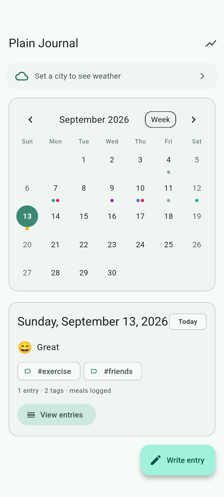
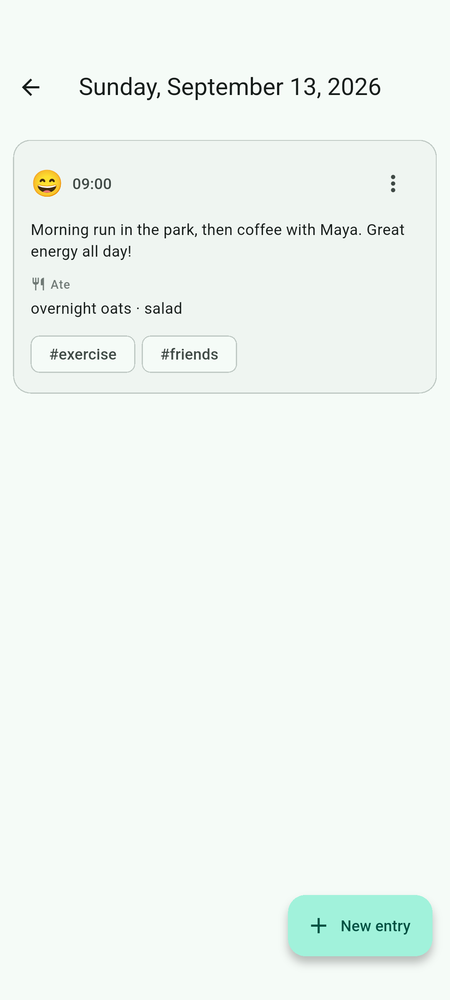
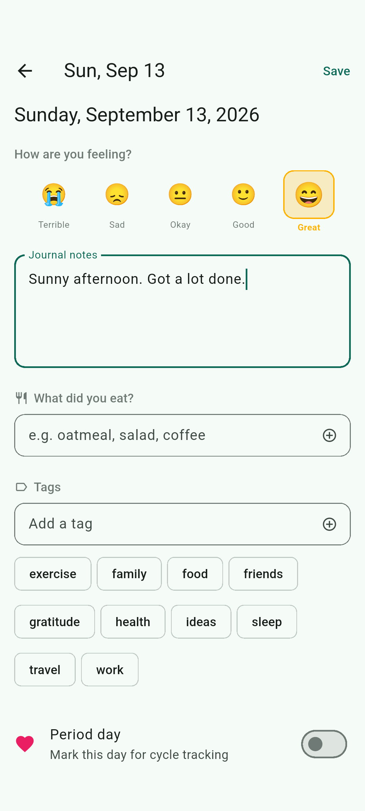
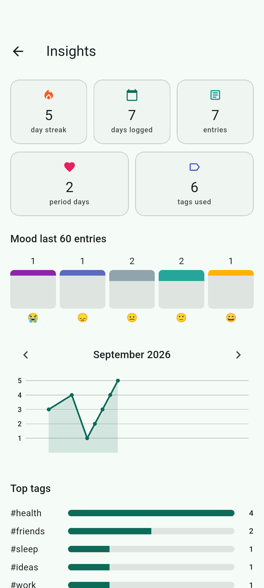
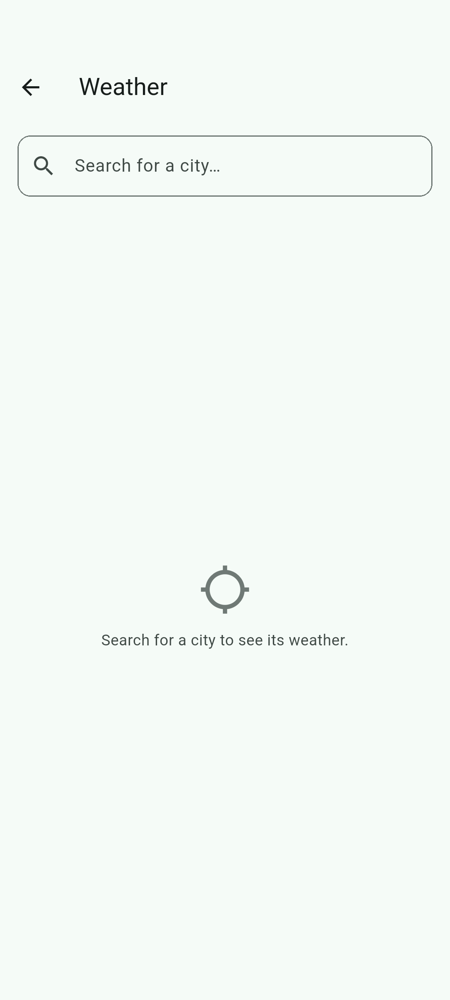

# Plain Journal

A private daily journal tracker for Android. Log your mood, meals, tags, and
period markers, then look back with a calendar and insights dashboard. Weather
for your chosen city is included — no account, no cloud, no tracking.

> ⚠️ **Work in progress** — distributed via [GitHub Releases](https://github.com/logan37/plain_journal/releases). A Play Store listing is planned.

## Features

- 📅 **Calendar home** — color-coded dots per day for mood and period
- ✍️ **Journal entries** — notes with a 5-point mood scale and custom tags
- 🍽️ **Food & period tracking** — optional, kept with each day's logs
- 🌤️ **Weather** — current conditions + 7-day forecast for a city you pick (Open-Meteo, no API key)
- 📊 **Insights** — streaks, mood distribution, monthly trend, top tags

## Screenshots

| Home calendar | Day view | Entry editor | Insights | Weather |
| --- | --- | --- | --- | --- |
|  |  |  |  |  |

## Install

Download the latest APK from the [Releases page](https://github.com/logan37/plain_journal/releases),
open it on your Android device, and allow "Install unknown apps" for your browser or
file manager.

## Privacy

All data stays **on your device** and is deleted when the app is uninstalled.
The only network call is to Open-Meteo for weather forecasts using the city you
choose. See [PRIVACY_POLICY.md](PRIVACY_POLICY.md) for details.

## Build

```sh
flutter pub get
flutter run               # run on a connected device/emulator
flutter build apk --release
```

To regenerate the marketing screenshots (requires an emulator/device):

```sh
flutter drive --driver=test_driver/integration_test.dart \
  --target=integration_test/screenshots_test.dart
```